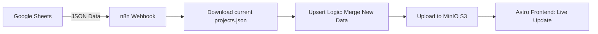

# 🚀 Soluções Digitais Portfolio

Um ecossistema de portfólio automatizado e de alto desempenho, desenvolvido com **Astro**, **n8n**, e **Google Sheets**. Este projeto transforma uma planilha do Google em um CMS dinâmico com sincronização em tempo real e gerenciamento avançado de mídia.

## 🌟 Visão Geral

O Soluções Digitais não é apenas um site estático; é uma plataforma orquestrada onde os dados e ativos visuais são gerenciados remotamente e servidos com latência mínima.

### Principais Características
- **CMS via Google Sheets:** Gerencie projetos, descrições e status sem tocar no código.
- **Orquestração n8n:** Automação inteligente para processamento de imagens e upsert de dados.
- **Galeria Multi-slot:** Suporte para carrossel de até 4 imagens por projeto (Capa + 3 Slides).
- **Design Premium:** Interface moderna com suporte a modo escuro, micro-animations e tipografia refinada.
- **Performance Extrema:** Construído com Astro para entrega de HTML leve e imagens otimizadas via MinIO.

---

## 🛠️ Stack Tecnológica

| Camada | Tecnologia | Função |
| :--- | :--- | :--- |
| **Frontend** | [Astro](https://astro.build/) | Framework SSR/Static de alta performance |
| **Estilização** | [Tailwind CSS v4](https://tailwindcss.com/) | Design system utilitário e responsivo |
| **CMS / Dados** | [Google Sheets](https://sheets.google.com) | Interface de gerenciamento de dados |
| **Orquestrador** | [n8n](https://n8n.io/) | Automação de fluxos e processamento de binários |
| **Storage** | [MinIO / S3](https://min.io/) | Armazenamento persistente de JSON e Imagens |

---

## 🔄 Fluxos de Trabalho

### 1. Sincronização de Dados
Sempre que o botão "Sincronizar Todo" é clicado na planilha, o fluxo abaixo é executado:


### 2. Gerenciamento de Imagens (Multi-slot)
Utilizando o **Google Apps Script (Sidebar Customizada)**:
1. Usuário seleciona o projeto e o destino (Capa ou Slides).
2. A imagem é enviada via Base64 para o n8n.
3. O n8n converte para binário e salva no MinIO com nomenclatura padronizada (`id-projeto-slide01.png`).
4. A URL é registrada automaticamente na coluna correspondente da planilha.

---

## 🚀 Como Começar

### Instalação Local
```bash
# Instalar dependências
npm install

# Rodar em desenvolvimento
npm run dev
```

---

## 📖 Documentação Detalhada

- [**Guia de Arquitetura**](./ARCHITECTURE.md) - Detalhes técnicos, Schema e fluxos avançados.

---
*Soluções Digitais v0.1.0 - Criado para performance e automação.*
