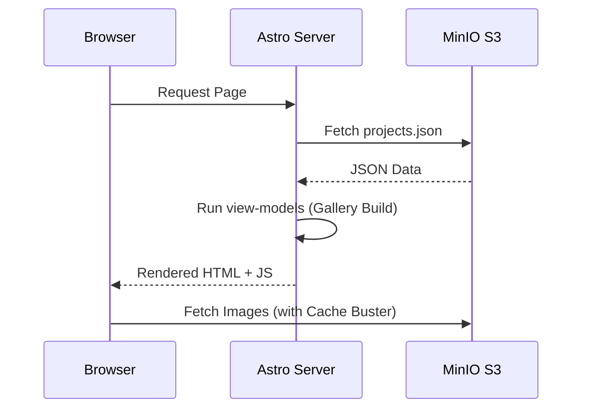

# 🏛️ Arquitetura Técnica: Soluções Digitais

Este documento detalha o funcionamento interno do ecossistema Soluções Digitais, as decisões de design e a integração entre os serviços.

## 📐 Estrutura do CMS (Google Sheets)

A planilha do Google atua como nossa "Single Source of Truth". O Schema deve seguir rigorosamente a ordem abaixo para compatibilidade com o Apps Script:

| Coluna | Campo | Descrição |
| :--- | :--- | :--- |
| **A** | `id` | Slug único do projeto (ex: `condor-em-casa`) |
| **B** | `title` | Nome exibido na interface |
| **C** | `company` | Marca/Empresa associada |
| **D** | `link` | URL externa do projeto |
| **F** | `image` | Path da imagem principal no bucket |
| **G** | `slide01` | Path do primeiro slide do carrossel |
| **H** | `slide02` | Path do segundo slide do carrossel |
| **I** | `slide03` | Path do terceiro slide do carrossel |
| **K** | `type` | Tags separadas por vírgula (Lp, Site, Software) |
| **L** | `status` | Checkbox para controle de visibilidade (TRUE/FALSE) |

---

## ⚙️ Fluxo n8n: Inteligência e Processamento

O n8n opera em dois webhooks principais. **Ambos escrevem direto no bucket MinIO via nó S3** — a aplicação Astro é read-only sobre o bucket e não expõe endpoints de escrita.

### 1. Webhook de Imagens (`POST /webhook/sync-portfolio-image`)

Recebe dados em Base64 para evitar problemas de codificação durante o transporte.

- **Passo 1:** Recebe `projectId` e `imageType` (`image`, `slide01`, `slide02`, `slide03`).
- **Passo 2 (Code Node):** Normaliza o nome do arquivo (`{projectId}[-{imageType}].png`) e decodifica o base64.
- **Passo 3 (S3 Node):** Upload binário ao bucket `lp-content` com MIME `image/png`.
- **Pós-upload:** o Apps Script do Sheet escreve a URL resultante na coluna correspondente.

### 2. Webhook de Dados (`POST /webhook/sync-portfolio`)

Realiza um upsert shallow no `projects.json` mantido em MinIO.

- **Passo 1:** Recebe `{ project }` ou `{ projects: [...] }` (sem campo `op` — só upsert).
- **Passo 2 (S3 Node):** Download do `projects.json` atual do bucket.
- **Passo 3 (Code Node):** Para cada projeto recebido, merge por `id` (`{ ...currentData[idx], ...newP }`) ou push se novo.
- **Passo 4 (S3 Node):** Upload do array completo como novo `projects.json`.

> ⚠️ **Gap conhecido:** não há operação de delete implementada em n8n. Para ocultar um projeto, desmarcar o checkbox `status` na Sheet. Para removê-lo de fato, editar o JSON no bucket ou criar um novo workflow.

---

## 🎨 Frontend Astro (O Consumidor)

### Processamento de View Models

O Astro consome o `projects.json` do MinIO e utiliza a função `prepareProjectForUI` para processar os dados antes de renderizar os componentes.

- **Compilação de Galeria:** Transforma os campos `image`, `slide01`, `slide02` e `slide03` em um array único para o Modal.
- **Normalização de URL:** Utiliza a função `getImageUrl` que aplica `encodeURI` para tratar espaços e prepende a URL base do MinIO quando o campo é um path relativo.

---
*Documentação Técnica v1.0 - Soluções Digitais.*
