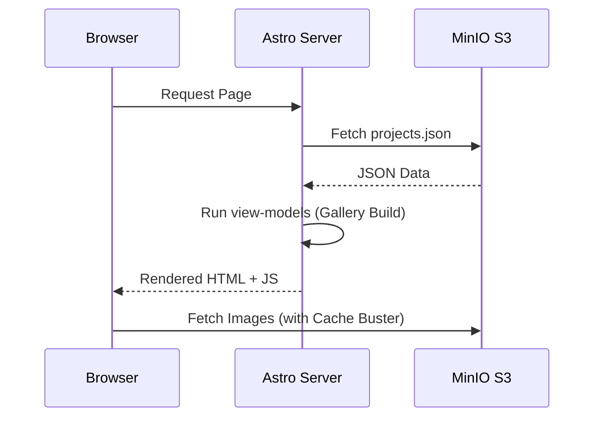

# 🏛️ Arquitetura Técnica: Soluções Digitais

Este documento detalha o funcionamento interno do ecossistema Soluções Digitais, as decisões de design e a integração entre os serviços.

## 📐 Estrutura do CMS (Google Sheets)

A planilha do Google atua como nossa "Single Source of Truth". O Schema deve seguir rigorosamente a ordem abaixo para compatibilidade com o Apps Script:

| Coluna | Campo | Descrição |
| :--- | :--- | :--- |
| **A** | `id` | Slug único do projeto (ex: `condor-em-casa`) |
| **B** | `title` | Nome exibido na interface |
| **C** | `company` | Marca/Empresa associada |
| **D** | `link` | URL externa do projeto |
| **F** | `image` | Path da imagem principal no bucket |
| **G** | `slide01` | Path do primeiro slide do carrossel |
| **H** | `slide02` | Path do segundo slide do carrossel |
| **I** | `slide03` | Path do terceiro slide do carrossel |
| **K** | `type` | Tags separadas por vírgula (Lp, Site, Software) |
| **L** | `status` | Checkbox para controle de visibilidade (TRUE/FALSE) |

---

## ⚙️ Fluxo n8n: Inteligência e Processamento

O n8n opera em dois webhooks principais que garantem a integridade dos dados e ativos.

### 1. Webhook de Imagens (`/sync-portfolio-image`)
Este fluxo recebe dados em Base64 para evitar problemas de codificação durante o transporte.
- **Passo 1:** Recebe `projectId` e `imageType`.
- **Passo 2 (Code Node):** Normaliza o nome do arquivo.
  - Regra: `projectId` + `suffix` (ex: `-slide01`) + `.png`.
- **Passo 3 (S3 Node):** Upload binário para o MinIO com o MIME type `image/png`.

### 2. Webhook de Dados (`/sync-portfolio`)
Realiza um `Upsert` atômico no arquivo central `projects.json`.

---

## 🎨 Frontend Astro (O Consumidor)

### Processamento de View Models
O Astro consome o `projects.json` do MinIO e utiliza a função `prepareProjectForUI` para processar os dados antes de renderizar os componentes.

- **Compilação de Galeria:** Transforma os campos `image`, `slide01`, `slide02` e `slide03` em um array único para o Modal.
- **Normalização de URL:** Utiliza a função `getImageUrl` que aplica `encodeURI` para tratar espaços e adiciona um *cache buster* dinâmico.

---
*Documentação Técnica v1.0 - Soluções Digitais.*
