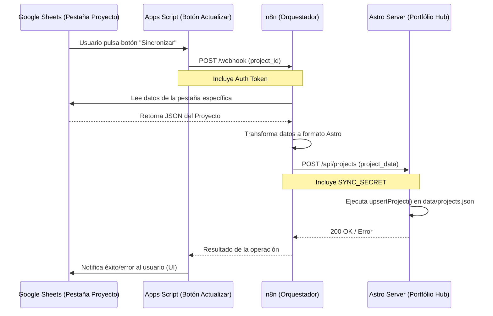

# Arquitectura de Sincronización: GSheets → n8n → Portfólio

Este documento describe el flujo de datos automatizado para actualizar los proyectos del portafolio directamente desde Google Sheets utilizando n8n como orquestador y Apps Script como disparador.

## 📊 Diagrama de Flujo



---

## 🛠 Componentes

### 1. Google Sheets (Origen de Datos)
- **Estructura:** Una pestaña (sheet) por cada proyecto. El nombre de la pestaña debe coincidir con el `id` del proyecto.
- **Campos sugeridos:** `title`, `company`, `link`, `production`, `image`, `desc`, `type`.

### 2. Apps Script (Trigger)
Función a nivel de Spreadsheet que se vincula a un botón:
```javascript
function syncCurrentProject() {
  const ss = SpreadsheetApp.getActiveSpreadsheet();
  const sheet = ss.getActiveSheet();
  const projectId = sheet.getName();
  
  const options = {
    method: 'post',
    contentType: 'application/json',
    payload: JSON.stringify({ id: projectId }),
    headers: { 'Authorization': 'Bearer YOUR_N8N_TOKEN' }
  };
  
  UrlFetchApp.fetch('https://tu-n8n.com/webhook/sync-project', options);
}
```

### 3. n8n (Orquestador)
Recibe el ID, lee el sheet correspondiente y envía un `POST` al endpoint del portafolio.

### 4. API del Portafolio (`/api/projects`)
Acepta operaciones `upsert`, `delete` y `replace_all`. Requiere el header `x-sync-token` coincidente con el `SYNC_SECRET` del servidor.

---

## 📁 Persistencia
A diferencia de versiones anteriores, el sistema ahora utiliza una **única fuente de datos local**:
- Ubicación: `/data/projects.json` (en la raíz del proyecto).
- Los cambios realizados vía sincronización son atómicos y se escriben directamente en este archivo.
